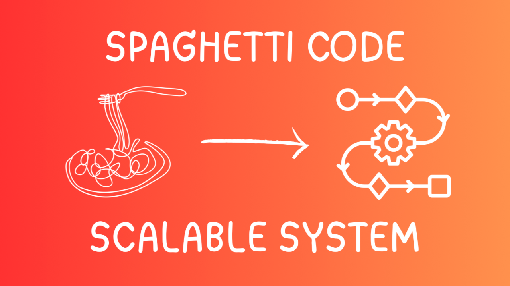
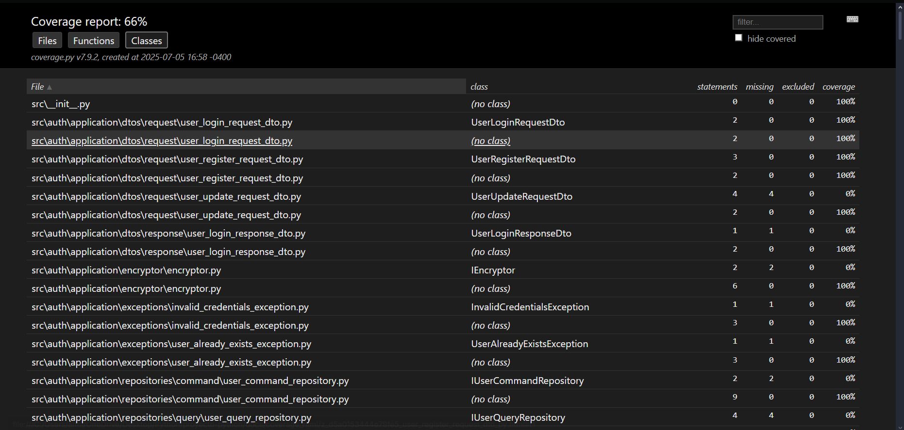

<div align="center">
  
</div>

<div align="center">
  
</div>

# Python FastAPI Project

This is a Python API built with FastAPI and managed with Poetry.

## Developers

<table align="center">
    <tbody>
        <tr>
            <td align="center"><a href="https://github.com/Fussita" rel="nofollow"><br><sub><b>Hualong Chiang</b></sub></a><br><a href="./public/icons/spaghetti-code.png" title="Commits"><g-emoji class="g-emoji" alias="book" fallback-src="https://github.githubassets.com/images/icons/emoji/unicode/1f4d6.png">📖</g-emoji></a></td>
            <td align="center"><a href="https://github.com/C102002" rel="nofollow"><br><sub><b>Alfredo Fung</b></sub></a><br><a href="./public/icons/computer-programming-spaghetti-code-programmer-sticker.jpg" title="Commits"><g-emoji class="g-emoji" alias="book" fallback-src="https://github.githubassets.com/images/icons/emoji/unicode/1f4d6.png">📖</g-emoji></a></td>
            <td align="center"><a href="https://github.com/DanielBortot" rel="nofollow"><br><sub><b>Daniel Borot</b></sub></a><br><a href="./public/icons/more-spaguetti.png" title="Commits"><g-emoji class="g-emoji" alias="book" fallback-src="https://github.githubassets.com/images/icons/emoji/unicode/1f4d6.png">📖</g-emoji></a></td>
            <td align="center"><a href="https://github.com/jghedderich" rel="nofollow"><br><sub><b>Juan Hedderich</b></sub></a><br><a href="./public/icons/Undocumented-Spaghetti-Code.webp" title="Commits"><g-emoji class="g-emoji" alias="book" fallback-src="https://github.githubassets.com/images/icons/emoji/unicode/1f4d6.png">📖</g-emoji></a></td>
        </tr>
    </tbody>
</table>

## Requirements

- Python 3.8+
- Poetry
- Docker (optional, for running with Docker)

## Installation

1.  **Clone the repository (if applicable):**

    ```bash
    git clone <your-repository-url>
    cd proyecto-python
    ```

2.  **Install dependencies using Poetry:**
    Make sure you have Poetry installed. If not, follow the instructions on the [official Poetry website](https://python-poetry.org/docs/#installation).
    ```bash
    poetry install
    ```
    This command will create a virtual environment if one doesn't exist and install all the dependencies specified in `pyproject.toml`.

## Running the Project

1.  **Activate the virtual environment:**
    Poetry (2.0.0+) has changed how virtual environments are activated. Use the `env activate` command:

    ```bash
    poetry env activate
    ```

    ```bash
    # other posible command to activate the virtual enviroment
    Invoke-Expression (poetry env activate)
    ```

    ```bash
    # In arch 
    source $(poetry env info --path)/bin/activate
    ```

    This command will return the path in which the virtual environment is activated, copy and paste that path into the terminal.

    If you have multiple environments for your project, you might need to specify the environment name (e.g., `poetry env activate my-env-name`). You can list available environments with `poetry env list`.

    Alternatively, if you prefer the older `poetry shell` command, you can install it as a plugin:

    ```bash
    poetry self add poetry-plugin-shell
    ```

    And then run:

    ```bash
    poetry shell
    ```

2.  **Run the FastAPI application:**
    The main application is typically run using Uvicorn. Assuming your main application instance is in `src/main.py` and named `app`:

    ```bash
    uvicorn src.main:app --reload
    ```

    ```bash
    # Run the app in debug mode
    uvicorn src.main:app --reload --log-level debug
    ```

    Replace `src.main:app` if your application entry point is different. The `--reload` flag enables auto-reloading when code changes, which is useful for development.

    The API will usually be available at `http://127.0.0.1:8000`.

## Running with Docker

This project includes a `Dockerfile` and `docker-compose.yml` for easy containerization.

1.  **Build and run the Docker container using Docker Compose:**

    ```bash
    docker-compose up -d
    ```

    This command will build the Docker image (if it doesn't exist or if changes were made to the Dockerfile) and start the service defined in `docker-compose.yml`.

2.  **Accessing the application:**
    The application running inside Docker will be accessible based on the port mapping defined in `docker-compose.yml`. Typically, this will also be `http://127.0.0.1:8000` or a port you've configured.

3.  **Stopping the Docker containers:**
    ```bash
    docker-compose down
    ```

### Running the test with pytest

#### 1. 🐳 Run the docker compose


```bash
docker-compose -f docker-compose-tests.yml up -d
```

#### 1. 🧪 Run Tests with pytest

```bash
# In the root of the project
pytest --cov=src --cov-report=html:docs/coverage_html
```

#### 2. 📊 View Test Coverage Summary

To see the summary of the test, you must open the file index.html inside the docs folder in your preference browser

* 🍎 macOS
```bash
bash open docs/coverage_html/index.html
```

* 🪟 Windows (PowerShell)

```bash
start docs/coverage_html\index.html
```

* 🐧 Linux
  
```bash
xdg-open docs/coverage_html/index.html
```

Example of what you shold see




## Project Structure

```
.
├── docker-compose.yml      # Docker Compose configuration
├── Dockerfile              # Dockerfile for building the application image
├── poetry.lock             # Poetry lock file for deterministic builds
├── pyproject.toml          # Poetry project configuration and dependencies
└── src/                    # Source code
    ├── main.py             # Main application entry point
    ├── common/             # Common utilities and base classes
    │   ├── application/
    │   ├── domain/
    │   └── infrastructure/
    └── utils/              # General utility functions and classes
```

## Further Development

- Add your API endpoints in the relevant modules under `src/`.
- Update dependencies in `pyproject.toml` and run `poetry lock` and `poetry install`.
